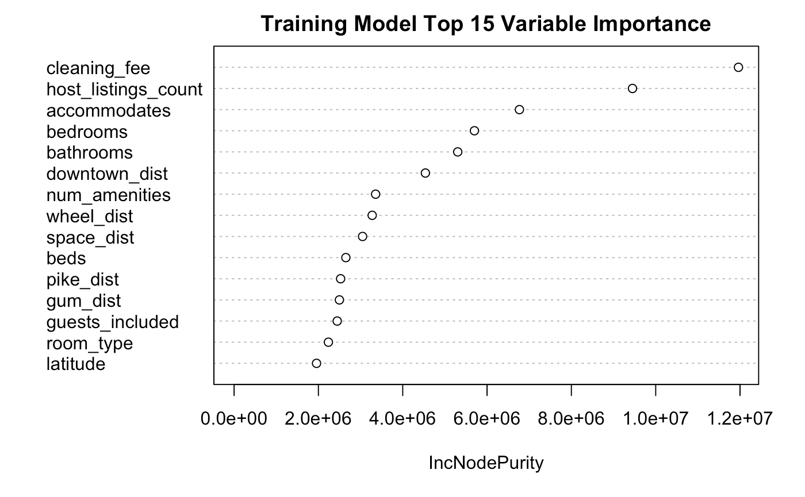
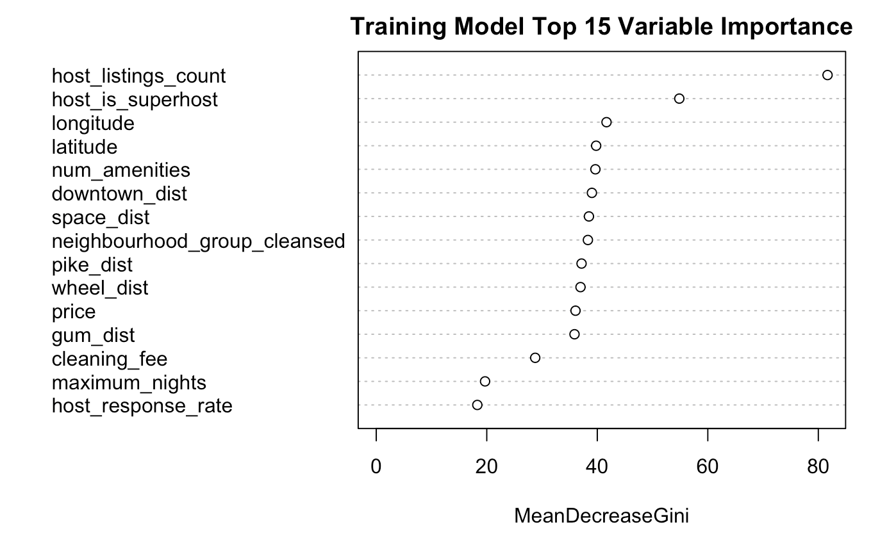

```{r setup, echo=FALSE}
knitr::opts_chunk$set(echo = FALSE) # show code
knitr::opts_chunk$set(warning = FALSE) # hide warnings
knitr::opts_chunk$set(message = FALSE) # hide messages
knitr::opts_chunk$set(cache = TRUE) # cache results 
```

```{r,echo=FALSE}
price = read.csv("price.csv")
review = read.csv("review.csv")
price.t = read.csv("price_test.csv")
review.t = read.csv("review_test.csv")

### process data

price.pre = price
price.pre$host_is_superhost = as.factor(as.numeric(price.pre$host_is_superhost) -1)
price.pre$host_identity_verified = as.factor(as.numeric(price.pre$host_identity_verified) -1)
price.pre$instant_bookable = as.factor(as.numeric(price.pre$instant_bookable) -1)
price.pre$host_response_rate = as.numeric(sub("%", "", price.pre$host_response_rate)) / 100
price.pre$host_response_time = as.factor(unclass(price.pre$host_response_time) -1)
price.pre$cleaning_fee = as.numeric(sub("$", "", price.pre$cleaning_fee, fixed = T))
price.pre$price = as.numeric(sub("$", "", price.pre$price, fixed = T))
price.pre$cleaning_fee[is.na(price.pre$cleaning_fee)] = 0
price.pre$price[is.na(price.pre$price)] = 0
price.pre$cancellation_policy = as.factor(as.numeric(price.pre$cancellation_policy))

review.pre = review
review.pre$host_is_superhost = as.factor(as.numeric(review.pre$host_is_superhost) -1)
review.pre$host_identity_verified = as.factor(as.numeric(review.pre$host_identity_verified) -1)
review.pre$instant_bookable = as.factor(as.numeric(review.pre$instant_bookable) -1)
review.pre$host_response_rate = as.numeric(sub("%", "", review.pre$host_response_rate)) / 100
review.pre$host_response_time = as.factor(unclass(review.pre$host_response_time) -1)
review.pre$cleaning_fee = as.numeric(sub("$", "", review.pre$cleaning_fee, fixed = T))
review.pre$price = as.numeric(sub("$", "", review.pre$price, fixed = T))
review.pre$cleaning_fee[is.na(review.pre$cleaning_fee)] = 0
review.pre$price[is.na(review.pre$price)] = 0
review.pre$cancellation_policy = as.factor(as.numeric(review.pre$cancellation_policy))

library(stringr)

amenities = sapply(price.pre$amenities, FUN=function(x) {
  # some function that just splits up all the words in each row of amenities
  s = toString(x)
  s = strsplit(s[[1]],",")
  newS = str_replace(s[[1]],'\\{',"")
  newS = str_replace(newS,'\\}',"")
  newS = str_replace(newS,'\"',"")
  newS = str_replace(newS,'\"',"")
  tolower(newS)
})

amenities.review = sapply(review.pre$amenities, FUN=function(x) {
  # some function that just splits up all the words in each row of amenities
  s = toString(x)
  s = strsplit(s[[1]],",")
  newS = str_replace(s[[1]],'\\{',"")
  newS = str_replace(newS,'\\}',"")
  newS = str_replace(newS,'\"',"")
  newS = str_replace(newS,'\"',"")
  tolower(newS)
})

num.amenities = c()
for(i in 1:length(price.pre$amenities)) {
  num.amenities[i] = length(amenities[[i]])
}

num.amenities.rev = c()
for(i in 1:length(review.pre$amenities)) {
  num.amenities.rev[i] = length(amenities.review[[i]])
}

price.pre$num_amenities = num.amenities
review.pre$num_amenities = num.amenities.rev

###

n <- nrow(price.pre)
sample.price <- price.pre[sample(n), ]
train.indices <- 1:round(0.7 * n)
train <- sample.price[train.indices, ]
test.indices <- (round(0.7 * n) + 1):n
test <- sample.price[test.indices, ]

nR <- nrow(review.pre)
sample.review <- review.pre[sample(nR), ]
train.indices.rev <- 1:round(0.7 * nR)
trainR <- sample.review[train.indices.rev, ]
test.indices.rev <- (round(0.7 * nR) + 1):nR
testR <- sample.review[test.indices.rev, ]

price.pre = price.pre[,-c(11,19)]
review.pre = review.pre[,-c(10,19)]

###

library(geosphere)
pike.place.lat = 47.6097 ; pike.place.long = -122.3422
space.needle.lat = 47.6205 ; space.needle.long = -122.3493
downtown.lat = 47.6050 ; downtown.long = -122.3344 
gum.wall.lat = 47.6084 ; gum.wall.long = -122.3404
great.wheel.lat = 47.6062 ; great.wheel.long = -122.3425

pike.dist = c()
space.dist = c()
downtown.dist = c()
gum.dist = c()
wheel.dist = c()

pike.dist.post = c()
space.dist.post = c()
downtown.dist.post = c()
gum.dist.post = c()
wheel.dist.post = c()
for(i in 1:length(price.pre$latitude)) {
  pike.dist[i] = distm(c(pike.place.long, pike.place.lat), c(price.pre$longitude[i], price.pre$latitude[i]), fun = distGeo) / 1609.344
  space.dist[i] = distm(c(space.needle.long, space.needle.lat), c(price.pre$longitude[i], price.pre$latitude[i]), fun = distGeo) / 1609.344
  downtown.dist[i] = distm(c(downtown.long, downtown.lat), c(price.pre$longitude[i], price.pre$latitude[i]), fun = distGeo) / 1609.344
  gum.dist[i] = distm(c(gum.wall.long, gum.wall.lat), c(price.pre $longitude[i], price.pre$latitude[i]), fun = distGeo) / 1609.344
  wheel.dist[i] = distm(c(great.wheel.long, great.wheel.lat), c(price.pre$longitude[i], price.pre$latitude[i]), fun = distGeo) / 1609.344
}

for(i in 1:length(review.pre$latitude)) {
  pike.dist.post[i] = distm(c(pike.place.long, pike.place.lat), c(review.pre$longitude[i], review.pre$latitude[i]), 
                            fun = distGeo) / 1609.344
  space.dist.post[i] = distm(c(space.needle.long, space.needle.lat), c(review.pre$longitude[i], review.pre$latitude[i]), 
                             fun = distGeo) / 1609.344
  downtown.dist.post[i] = distm(c(downtown.long, downtown.lat), c(review.pre$longitude[i], review.pre$latitude[i]), 
                                fun = distGeo) / 1609.344
  gum.dist.post[i] = distm(c(gum.wall.long, gum.wall.lat), c(review.pre$longitude[i], review.pre$latitude[i]), 
                           fun = distGeo) / 1609.344
  wheel.dist.post[i] = distm(c(great.wheel.long, great.wheel.lat), c(review.pre$longitude[i], review.pre$latitude[i]), 
                             fun = distGeo) / 1609.344
}

review.pre$pike_dist = pike.dist.post ; review.pre$space_dist = space.dist.post
review.pre$downtown_dist = downtown.dist.post ; review.pre$gum_dist = gum.dist.post
review.pre$wheel_dist = wheel.dist.post
price.pre$pike_dist = pike.dist ; price.pre$space_dist = space.dist
price.pre$downtown_dist = downtown.dist ; price.pre$gum_dist = gum.dist
price.pre$wheel_dist = wheel.dist
```

# Introduction

The main dataset we are working with in this project has data on Airbnb listings in
Seattle. Through analyzing this data, we are trying to fulfill two main objectives. First, we are
trying to determine whether several host and housing quality measurements have an effect on
the price of a given listing. Second, we are attempting to determine whether these same
measurements have an effect on the review score of the given listing. The first task is a
regression based task and the second is a classification based solution. Our tasks have two
different datasets, of which the price dataset has 5200 observations and 25 variables, including
our response variable $\it{price}$. Our review dataset has 4043 observations and 26 variables,
including our response variable $\it{review\_scores\_rating}$. Initially, there were 48 NA values in the
price dataset and 34 NA values in the review dataset. These NA variables were entirely
contained in 2 columns, $\it{price}$ and $\it{cleaning\_fee}$. We treated the NA values by converting them
to 0, meaning that there was no price or cleaning fee for a given listing.

# Exploration

We begin by taking a look at the different neighborhoods in Seattle. The table below summarizes the top and bottom five average prices of listings in each neighborhood and its proportion over both datasets. We see that about 18% of the listings alone are located in Downtown Seattle. On average, the price per listing there is about 60 dollars more expensive than the overall average of about `r signif((mean(review.pre$price) + mean(price.pre$price)) / 2,3)` dollars. Note that in Queen Anne, a notoriously expensive area of Seattle, the average price is about 30 dollars more expensive than the overall average. This difference in price hints at the importance of location for an Airbnb listing. 

```{r}
library(plyr)
library(knitr)
neighborhood.means = aggregate(price.pre[,"price"], list(price.pre$neighbourhood_group_cleansed), mean)
n.means = aggregate(review.pre[,"price"], list(review.pre$neighbourhood_group_cleansed), mean)
prop = ddply(price.pre, .(neighbourhood_group_cleansed), summarize, prop = 100 * length(neighbourhood_group_cleansed) / nrow(price.pre))
prop2 = ddply(review.pre, .(neighbourhood_group_cleansed), summarize, prop = 100 * length(neighbourhood_group_cleansed) / nrow(review.pre))
a = cbind("mean price" = (neighborhood.means[,2] + n.means[,2]) / 2, "proportion" = (prop[,2]+prop2[,2])/2)
rownames(a) = names(table(price.pre$neighbourhood_group_cleansed))

top = a[c(7,13,4,10,3),]
bottom = a[c(16,11,2,9,6),]
kable(rbind(top,bottom))
```

Each listing in the dataset included its unique latitude and longitude coordinates. To make the latitude and longitude measurements more useful and to improve the feature set, we tabulated the latitude/longitude coordinates of five Seattle places of interest: downtown, the Space Needle, the Gum Wall, Pike Place Market, and the Great Wheel. We wrote a script that calculated, for each listing, the distance between the listing and each of the five important locations in Seattle. This provided context to our task because it established how well-located certain listings were in comparison to others.

More specifically, for both the regression and classification task, predicting $\it{price}$ and classifying
$\it{review\_scores\_rating}$ in the best way required first looking at the data and evaluating the
feature set. Both datasets contained the same feature set with the review dataset containing an
extra variable - our response $\it{review\_scores\_rating}$ for the classification task.

We continued by looking for potentially problematic features in the dataset. In the price
dataset, there were two: $\it{amenities}$ and $\it{room\_type}$. The $\it{amenities}$ variable, for each listing, lists
the specific amenities that the listing has such as wifi access, TV availability and air
conditioning. The $\it{room\_type}$ variable lists the type of the room offered by a given listing. These
two features presented probelmatic due to the number of levels of the factor variables.

Each index in the $\it{amenities}$ column contained a dictionary containing that specific
listing’s amenities. Logically, we decided to test if the number of amenities for a given listing
would affect its price instead of the amenities themselves. We parsed the $\it{amenities}$ column
and produced a new feature $\it{num\_amenities}$ that reported the total number of amenities for
each listing. We dropped the original amenities column from our analysis, and dropped the
room type column as well from our analysis, as the ordering of its levels presented problems in
the model creation process. We kept all other variables that were initially in the dataset in some
form in our analysis.

Finally, multiple features in the dataset required recoding. For instance, we refactored
the $\it{host\_is\_superhost}$, $\it{host\_identity\_verified}$, and $\it{instant\_bookable}$ variables that were
originally true/false variables coded as “t” and “f” into 0/1 variables with 1 coded as true. The 
$\it{host\_response\_rate}$ variable was a percentage in the original dataset, and was changed into a proportion. 
Two variables: $\it{host\_response\_time}$ and $\it{cancellation\_policy}$  were refactored into categorical variables with numbers representing
levels of factors instead of words. Our response variable $\it{price}$ and the $\it{cleaning\_fee}$ variable
contained the “$” character before their values - this character was removed and the predictors
were converted to numeric variables.

## Regression Model Selection

At this point, after processing and cleaning the data, we had a feature set that we felt
good about. To move forward with the regression task, we knew that some variables had linear
correlation with our response variable $\it{price}$, namely $\it{cleaning\_fee}$ and $\it{beds}$. It seemed that
fitting a multiple linear regression model was a logical place to start as a baseline technique for
prediction. 

To begin, we split our price dataset into a training and test set with 75% of data in the
price dataset allocated to training and 25% allocated to a validation test set. We fit a multiple
linear regression model, regressing price against all the variables in our final,
processed training set. 
\begin{equation}
lm(price \sim., data = price.train)
\end{equation}
The goodness of the fit was evaluated in two ways: against our
regression assumptions and with cross-validated mean squared error. The residuals vs fitted
values plot of the fitted regression object, found below, showed a cluster of points around 0 with high
outliers, potential influential points, and an uneven distribution. Our baseline linear model was
not optimal for the dataset, and we inferred another technique could produce a better fit. The
cross-validated error for the linear model using k-fold cross validation was approximately 9188.

```{r,echo=FALSE}
train.lm = train[, -c(10, 19)]
test.lm = test[, -c(10, 19)]
mlr = lm(price~., data = train.lm)
plot(mlr$residuals ~ mlr$fitted.values,xlab="Fitted Values",ylab = "Residuals", main = "Residuals vs Fitted Values")
```

With our baseline in hand, we logically assumed that it’s possible the fit could be
improved by improving the bias-variance tradeoff we were dealing with. To make the model
more generalizable and get a sense for which predictors were important, we fit a ridge and
lasso model on our training set, where equations 2 and 3 represent ridge and lasso respectively.
\begin{align}
cv.glmnet(model.matrix(price \sim., data = price.train), price.train.price, alpha = 0) \\
cv.glmnet(model.matrix(price \sim., data = price.train), price.train.price, alpha = 1) 
\end{align}
We used cross validation techniques to establish the optimal lambda penalty value for both the ridge and lasso
regression models above. Our cross-validated mean squared errors for both ridge and lasso were
around 8942 and 8940 respectively which was an improvement on our baseline model. 
We further explored trees and random forests. Given the data had a mix of categorical
and numeric predictors, with some outliers in the data, trees and random forests provide a
robust measure that does not lose predictive power to high outliers and non-linearity. We also fit a
normal decision tree, and a pruned version of the tree, shown below.
\begin{align}
tree = rpart(price \sim., data = price.train) \\
pruned.tree = prune(tree, cp = 0.019)
\end{align}
From the plot of the decision tree we chose a cp parameter that minimized relative error. The cross validated mean
squared errors both the normal decision tree and pruned tree improved upon ridge/lasso and
was 6572 and 6999 respectively.

Random forests are an algorithmic improvement on decision trees, due to their greedy
search on a subset of features for the best split to make rather than evaluating all features in a
decision tree. In addition, random forests retain the strengths of decision trees in working with
numeric and categorical predictors and generally produce low bias, moderate variance models. The algorithm averages over mutliple predictions to better predict the response. 

We fit a random forest with 500 trees as a baseline on our training set.
\begin{align}
randomForest(price \sim., data = price.train, ntree = 500)
\end{align}
Random forests had the lowest cross-validated mean squared error around 4005. The
predictions that the random forest produced were the closest to the price of the listings in our
training set. There are two parameters of interest in the random forest algorithm: the number of
trees to grow and the number of variables randomly sampled as candidates for each split. 
We attempted to tune the random forest to find the best possible number of variables to sample
for each split to minimize error, using tuneRF. Tuning the number of trees to
grow for a random forest isn’t necessary after a certain amount of trees, as the forests stabilize
at around 200 trees. Our tuned random forest used the default number of variables to consider
for splits. We made our predictions on the test set using the tuned random forest.

After trying various algorithms, we concluded that random forests produced the lowest
prediction error without extreme bias or variance, and we chose the random forest model as
our final regression model. Regarding the relationship between the predictors in the model and
the predictions themselves, an advantage of random forests is that they have a very
interpretable variable importance measure that compares the prediction strength of each
variable. 



The most powerful predictors for price in terms
of prediction strength were $\it{cleaning\_fee}$ and $\it{host\_listings\_count}$. Interestingly, the variables we added for location mapping were among the best predictors in the feature set. Our model
selection process led us to choose our random forest model as the model that best explains
the test data.

The table below summarizes the cross-validated MSE of each of the models tested.

```{r,echo=FALSE}
library(knitr)
models = c("Linear","Lasso", "Ridge", "Tree", "Pruned Tree", "Random Forest")
mse = c(9188,8940,8942,6572,6999,4005)
kable(cbind(models,mse))
```


## Classification Model Selection

Similar preprocessing was done for the price and review datasets, hence the model
selection process was similar for both the regression and classification tasks - albeit with
different algorithmic techniques. We split our review dataset into 75% training and 25% test as
done in the regression task. The amenities and property_type variables were dropped from the
overall dataset as in the previous task. The same location mapping and amenities cleaning
added to the regression data feature set was included in the classification data feature set.To
get a baseline accuracy, it seemed logical to begin with a naive classifier.

We chose a Naive Bayesian classifier, shown below, as a baseline to learn more about our ability to
classify for our response variable review_scores_rating. 
\begin{equation}
naiveBayes(review\_scores\_rating \sim., data = review.train)
\end{equation}
Our cross-validated misclassification error was 17% as a baseline. Given that our response variable
review_scores_rating was split into two classes - 0 and 1 - we thought logistic regression
would serve as a good starting point.

The following logistic regression model was fit on the training set, which resulted in a cross-validated misclassification error of 12.8%:
\begin{equation}
glm(review\_scores\_rating \sim., data = review.train, family = "binomial")
\end{equation}
The variables that contribute most to the fit were
$\it{cancellation\_policy}$, $\it{num\_amenities}$, $\it{neighborhood\_group}$, $\it{host\_identity\_verified}$ and
$\it{host\_is\_superhost}$. The cleaning of the amenities variable done in preprocessing, on the
evidence of the logistic fit, seemed to improve the feature set. However, there seemed to be
possible improvements in misclassification accuracy, hence we tried three other classification
techniques: support vector machines, boosting, and tree-based random forests.

Support vector machines were deployed in three different ways: utilizing a linear kernel,
polynomial kernel and a radial kernel, shown below as equations 9, 10, and 11 respectively. The models were trained on the training set with the same set of predictors used for the naive and logistic models. 
\begin{align}
svm(review\_scores\_rating \sim., data = review.train, kernel = "linear") \\
svm(review\_scores\_rating \sim., data = review.train, kernel = "polynomial") \\
svm(review\_scores\_rating \sim., data = review.train, kernel = "radial")
\end{align}
Without tuning, the three methods all produced cross-validated misclassification error of approximately 12%,
improving on the logistic regression fit. Tuning the models for the parameters cost and gamma
took an long time to run due to the large feature set - and the best models marginally improved
misclassification error.

Boosting, like random forests, is an ensemble learner that produces low bias, moderate
variance models. We theorized that adaptive boosting would be an algorithmic improvement on
all three of the classification techniques used previously due to its additive nature. Utilizing
gradient descent to minimize error over a fixed number of trees led us to believe boosting
would increase classification accuracy. We fit an adaptive boost model with 100 iterations,
using the “Freund” Adaboost algorithm. Cross-validated misclassification error dropped to sub 12% - approximately 11.7%.
\begin{equation}
boosting(review\_scores\_rating \sim., data = review.train, mfinal = 100, coeflearn = "Freund")
\end{equation}

Finally, we chose to try random forests for many of the same reasons that we denoted
for the regression task and for its flexibility. We fit a random forest with 500 trees on the training data. 
\begin{equation}
randomForest(review\_scores\_rating \sim., data = review.train, ntree = 500, na.action = na.exclude)
\end{equation}

Initially, the cross-validated misclassification error hovered around
where the boosting algorithm was performing, but after tuning the number of variables
randomly sampled as candidates for each split, random forests produced the lowest cross-validated
misclassification rate of 11.35%. The boosting algorithm and the random forest
algorithm produced similar results, but since the random forest classifier was easily
interpretable i.e. it was clear to see which variables that were important for improving accuracy,
we chose our random forest model as our final model. In a similar fashion to the regression
task, we modeled the relationship between the predictors and their relative importance to the
fit. 



The most impactful features for classifying $\it{review\_scores\_rating}$ were $\it{host\_listings\_count}$ and $\it{host\_is\_superhost}$. For classifying the desirability of a listing, our engineered features performed very well, but $\it{host\_listings\_count}$ surprisingly had twice as much impact on the random forest's model than all the other variables. Hosts with more listings must be more experienced and may have better practices for providing users a more desirable experience. This idea is supported by the fact that $\it{host\_is\_superhost}$ is the second most importance variable according to our model.

The table below summarizes the cross-validated missclassification rate of each of the models tested.

```{r,echo=FALSE}
library(knitr)
models = c("Naive Bayes","Logistic Regression", "Linear SVM", "Polynomial SVM", "Radial SVM", "ADA Boost", "Random Forest")
missclassification = c(17.8,12.8,12.1,12.1,12.0,11.7,11.4)
kable(cbind(models,missclassification))
```

# Analysis of Results

The performance, on both the regression and classification task, of our predictor set
was better than baseline models on average. That being said, there were some noticable patterns 
in the missclassified listings that are worth mentioning. To begin with, over 95% of the training
points missclassified had "Real Bed" for $\it{bed\_type}$. Moreover, half of the missclassified 
points were "Entire home/apt" or "Private room". Based on the importance plots from the random 
forest models, we saw that the geographical features were heavily relied upon, but characteristics
about the perks of the venue itself were not adequately used. This was, in part, a result of how
the $\it{amenities}$ column was preprocessed. Features indicating the presence of desirable 
ammenities such as a gym, gatekeeper, free breakfast, or even a pool could have been included to 
provide a more holistic look at the listing.

With more time, there are a number of other steps that can be taken. In particular, the data was 
skewed and contained high outliers in multiple categories. High outliers existed in several numeric variables in the
dataset, specifically $\it{price}$, $\it{cleaning\_fee}$, $\it{maximum\_nights}$ and $\it{accommodates}$. An example of a
possible outlier that could skew price would be a mansion in an expensive neighborhood that
could accommodate a high number of guests, and would have a corresponding high cleaning
fee. More time dedicated to filtering the data and making it as granular and useful as possible
would surely improve our model building and selection process, and reduce mean squared
error and misclassification error respectively.

Another area for improvement is feature engineering and selection. The features that we
created to create context for our latitude/longitude coordinates using distance measures, and
the data cleaning done on the amenities column did very well in our final models, and they
were some of the largest contributors to the fit and resulting predictions on the test set. To that
end, exploring logical correlations could produce a richer feature set. For example, higher
priced listings tend to be more desirable, have more amenities and a better location. Exploring
the time of the year when listings are most popular could be fruitful. It’s also important to note
that the data we have is from the host’s perspective, including data on the user could further
enrich the dataset and possibly provide a more complete picture as to what influences price
and review score.


# Extra Credit: Boston

## Exploration

We investigated mid-sized cities, with a large enough dataset, and decided on Boston. Following a similar procedure to our pre-processing for the Seattle dataset, we stripped all the values of unnecessary characters and converted them into numeric values and factors. Likewise, we decided to create a feature representing the number of amenities in each listing and removed the $\it{amenities}$ columns. We also removed the $\it{property\_type}$ and $\it{neighbourhood\_group\_cleansed}$ columns as they proved problematic due to many NA values and the number of levels. Since the geographical locations proved to be very important in our previous models, we added the relative distances to three popular locations in Boston: Fenway Park, Faneuil Hall Marketplace, and Freedom Trail. 

## Regression Model Selection

As before, we split our data into a training and testing set, subsetting 75% and 25% of the original data respectively. We begin by taking a look at a multivariate linear model as our baseline model, and train our model on our training data set.
\begin{equation}
lm(price \sim., data = boston.train)
\end{equation}
Upon running a 5-fold cross-validation, the linear model resulted in an MSE of 10108. 

Based on the success of the trees model from our Seattle dataset, we can take a look at trees and pruned trees, represented in the code below respectively.
\begin{align}
tree = rpart(price \sim., data = boston.train) \\
pruned.tree = prune(tree, cp = 0.019)
\end{align}
Once again, the unpruned tree performed better than the pruned tree, resulting in an MSE of 8468 and 9675 respectively. Compared to the Seattle dataset, this has a worse prediction power for $\it{price}$.

Last but not least, we now move onto random forests. We used 500 trees due to the success from our Seattle dataset. The model fit is shown below.
\begin{equation}
randomForest(review\_scores\_rating \sim., data = boston.train, ntree = 500, na.action = na.exclude)
\end{equation}
The 5-folds cross-validated MSE for the random forest model came out to be 2370. This result is much lower than the best prediction on the Seattle dataset. Looking at the plots of the importance of the variables, we see that the $\it{cleaning\_fee}$ and $\it{room\_type}$ were very informative.

To summarize, the table below culminates the MSE values for all the models tested.

```{r,echo=FALSE}
library(knitr)
models = c("Linear","Tree","Pruned Tree","Random Forest")
mse = c("10108.32","8467.91","9674.71","2370.46")
kable(cbind(models,mse))
```

## Classification Model Selection

Given the dataset that we had was processed very similar to our Seattle dataset, a similar
methodical approach to finding the best model was utilized. As before, we fit a naive bayes
model to function as our baseline for comparison. We fit a Naive Bayes model with
$\it{review\_scores\_rating}$ as our response variable. 
\begin{equation}
naiveBayes(review\_scores\_rating \sim., data = boston.train)
\end{equation}
A 5 fold cross validation returned a
misclassification error on our validation set of 28.22%. There was definite improvement here,
and with the similar idea that support vector machines fit with different kernel functions could
separate the two classes effectively, we decided to fit an SVM.

Three SVM models were fit with three different kernel functions: a linear, polynomial and radial
SVM. 5 fold cross validation returned misclassification errors of 25.50%, 28.22% and 22.65%
respectively. 
\begin{align}
svm(review\_scores\_rating \sim., data = boston.train, kernel = "linear") \\
svm(review\_scores\_rating \sim., data = boston.train, kernel = "polynomial") \\
svm(review\_scores\_rating \sim., data = boston.train, kernel = "radial")
\end{align}
The radial kernel, as expected, performed best on the data since it is the kernel
with the most flexibility. Interestingly, the polynomial kernel SVM performed worse than the
linear kernel SVM, indicating that a linear fit would perform better on the data. Our next course
of action would be to fit the data through a gradient boosting technique and a random forest.
These two techniques were chosen because they produced some of the best results in our
previous analysis and logically, we assumed they would be productive on the Boston dataset
as well.

The boosting method utilizing the AdaBoost learner was fit on the same formula as the other
techniques and its cross-validated misclassification error was 22.98%. 
\begin{equation}
boosting(review\_scores\_rating \sim., data = boston.train, mfinal = 100, coeflearn = "Freund")
\end{equation}
The Radial SVM
performed better than the boosted tree technique. It’s possible that the data is especially
amenable to a complex decision boundary that the radial kernel provides. The ensemble
learner (boosting) wasn’t as productive at classification.

Finally, we fit a random forest on the training data with $\it{review\_scores\_rating}$ as the response
variable. 
\begin{equation}
randomForest(review\_scores\_rating \sim., data = boston.train, ntree = 500, na.action = na.exclude)
\end{equation}
Since the boosted method didn’t do substantially better than the radial SVM, we
hypothesized that random forest wouldn’t do much better than the boosting technique. The
cross-validated misclassification error for the random forest was 21.74%. It performed the best
out of all techniques tried. We tuned the random forest for the number of variables randomly
sampled as candidates for the best possible split. The tuned classifier had marginally better
misclassification error of 21.23%.

To summarize, the table below culminates the misclassification rates of each of the models tested.

```{r,echo=FALSE}
library(knitr)
models = c("Naive Bayes","Linear SVM","Polynomial SVM", "Radial SVM", "ADA Boost", "Random Forest", "Tuned Random Forest")
missclassification = c("0.2823","0.2550","0.2823","0.2266","0.2298","0.2175","0.2123")
kable(cbind(models,missclassification))
```

## City Comparison

Thus, we see that the overall prediction of $\it{price}$ for the Boston dataset was almost twice as good as that of the Seattle dataset, but the misclassification rates of the Boston $\it{review\_scores\_rating}$ variable were much worse. The best performing model for both datasets was the Random Forest, and taking a look at the important variables of each model, we note that in Seattle the features relating to the geographical location of the listings proved most impactful than some of the features relating to the actual location. There are many iconic areas spread out in Seattle that might explain the high desirability of these variables. In Boston, overall comfort within the listing was very highly regarded. This is made evident by the importance of hosting experience and lower cleaning fees. The nearby hotspots still proved significant, but in terms of the magnitude of the Gini indices of the variables in the Boston dataset's Random Forest, they were nowhere as important. The $\it{host\_is\_superhost}$ variable had the highest Gini index for Seattle, reaching 80, whereas $\it{host\_listings\_count}$ was 120. In our exploration of both datasets, we concluded that more data would provide better accuracy and mean squared error predictions, and next steps for our Boston dataset would be to try further modeling through Neural Nets and acquisition of more user data. 
